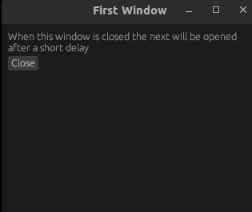

Demonstrates how to open several windows after each other.

Expected order of execution:

- When the example runs a first window will be shown.
- Once the first window is closed after a delay a second window will be shown.
- Similarly, when the second window is closed after a delay a third will be shown.
- Once the third is closed the program will stop.

NOTE: this doesn't work on Mac due to <https://github.com/rust-windowing/winit/issues/2431>.
See also <https://github.com/emilk/egui/issues/1918>.

```sh
cargo run -p serial_windows
```


