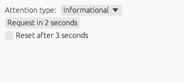

An example of requesting a user's attention to the main window, and resetting the ongoing attention animations when necessary. Only works on native platforms.

```sh
cargo run -p user_attention
```


